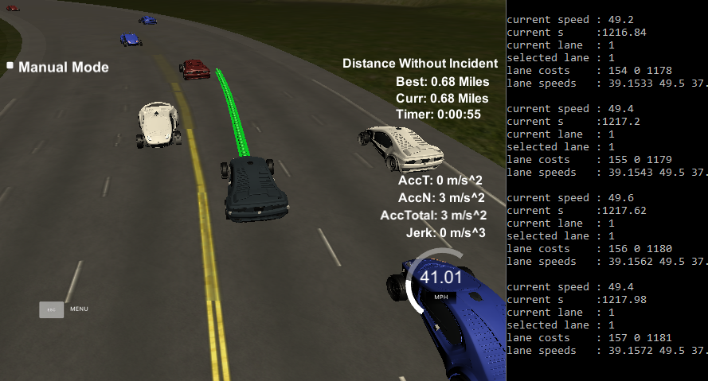
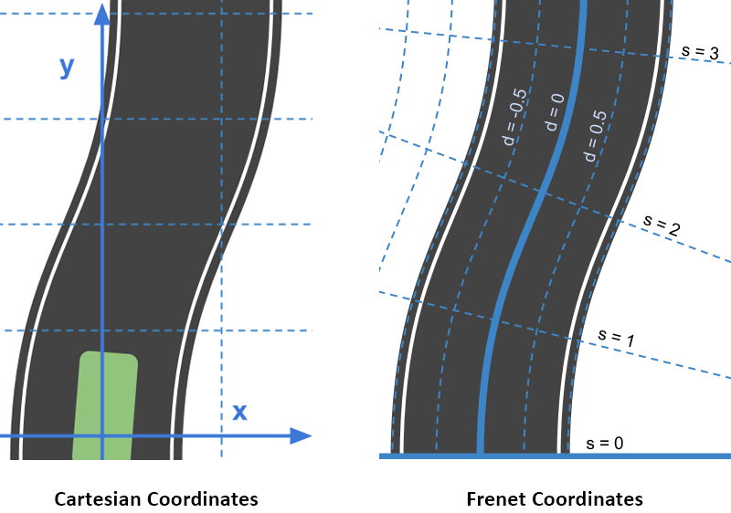
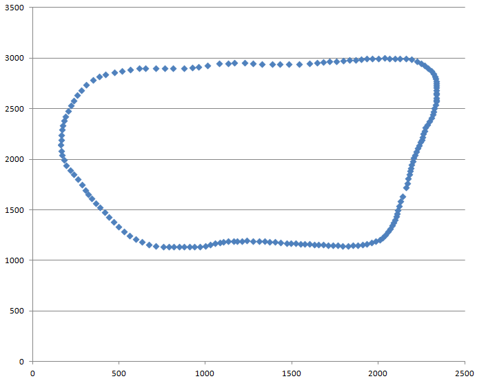
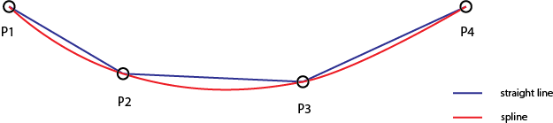

# CarND-Path-Planning-Project
Self-Driving Car Engineer Nanodegree Program



### Goals
The goal of this project is to safely navigate around a virtual highway with other traffic that is driving +-10 MPH of the 50 MPH speed limit. The simulator provides the car's localization and sensor fusion data. The car should try to go as close as possible to the 50 MPH speed limit, which means passing slower traffic when possible. The car should avoid hitting other cars at all cost as well as driving inside of the marked road lanes at all times, unless going from one lane to another. The car should not experience total acceleration over 10 m/s^2 and jerk that is greater than 10 m/s^3.

### Frenet Coordinates

Planning a trajectory in Cartesian coordinates is challenging, so instead we'll be using Frenet coordinates:

  * **s** - position along the road (longitudinal position)
  * **d** - side to side position (lateral position)

In the Frenet space the curvature of the road is ignored, so the trajectory can be planned as if the road was straight. The planned trajectory is then transferred back to the Cartesian space.



### Highway Map
There is a list of waypoints provided around the simulated track. Each waypoint has [x,y,s,dx,dy] values.
  * **[x, y]** - the waypoint's position
  * **s** - distance along the road [in meters]
  * **[dx, dy]** - unit normal vector pointing outward of the highway loop

The highway's waypoints loop around so the Frenet s value, distance along the road, goes from 0 to 6945.554.



### Car Localization Data

The simulator sends the following localization data for our car:

  * **[x, y]** - position in map coordinates (Cartesian)
  * **[s, d]** - position in Frenet coordinates
  * **yaw** - yaw angle (heading)
  * **speed** - speed in MPH

### Sensor Fusion Data

The simulator provides sensor fusion data for other cars on the road, including their position in map and Frenet coordinates and their speed in.

---

## Path Planning

Our goal is to drive as fast as possible within the speed limit while avoiding collisions with other cars on the road. To achieve this the car should:

  * Increase speed up to the limit if there are no cars ahead in its lane
  * Slow down to match the speed of the car in its lane if within a certain distance
  * Pick a different lane if there is a faster lane available and changing to that lane is safe

### Lane Selection

My method calculates a cost for each lane:

  * A large cost is added if there is another car too close to avoid collision
  * When approaching a car, add a cost proportinal to speed difference, and inversely proportional to the distance to the other car
  * Determine the speed of the lane by looking ahead to the closest car within a larger range and add a cost proportinal to the difference between our target speed (speed limit) and the lane speed
  * Add a small cost for lane change and a larger cost to discourage double lane change
  * Add a large cost to lanes other then the selected lane bwhile changing lanes to prohibit the car from selecting another lane while changing lanes

After calculating all lane costs, the lane with the lowest cost is selected. The speed is adjusted to match the car driving in front, or to the speed limit if the lane is open.

### Creating a Smooth Trajectory

While creating a trajectory we have to make sure that there are no sudden changes in direction. Simply connecting points with a straight line would create an uncomfortable driving experience ("jerks" at **P2** and **P3** on the illustration below). Instead a spline is fit over anchor points along the trajectory using a [spline library](http://kluge.in-chemnitz.de/opensource/spline/), resulting in a smooth path.



---

## Future Improvements

  * Use a more robust method instead of spline parameter tuning to detect and avoid "jerks".
  * Implement an algorythm like Hybrid A* to find the most optimum path.
  * Currently the car can get stuck following a car if there is another car driving next to it in the neighboring lane. Slowing down to let the car in the next lane go could allow a lane change that might eventually result in the ability to pick a faster lane.

---

## Build Instructions

1. Clone this repo.
2. Make a build directory: `mkdir build && cd build`
3. Compile: `cmake .. && make`
4. Run it: `./path_planning`.

## Dependencies

* cmake >= 3.5
 * All OSes: [click here for installation instructions](https://cmake.org/install/)
* make >= 4.1
  * Linux: make is installed by default on most Linux distros
  * Mac: [install Xcode command line tools to get make](https://developer.apple.com/xcode/features/)
  * Windows: [Click here for installation instructions](http://gnuwin32.sourceforge.net/packages/make.htm)
* gcc/g++ >= 5.4
  * Linux: gcc / g++ is installed by default on most Linux distros
  * Mac: same deal as make - [install Xcode command line tools]((https://developer.apple.com/xcode/features/)
  * Windows: recommend using [MinGW](http://www.mingw.org/)
* [uWebSockets](https://github.com/uWebSockets/uWebSockets)
  * Run either `install-mac.sh` or `install-ubuntu.sh`.
  * If you install from source, checkout to commit `e94b6e1`, i.e.
    ```
    git clone https://github.com/uWebSockets/uWebSockets
    cd uWebSockets
    git checkout e94b6e1
    ```

